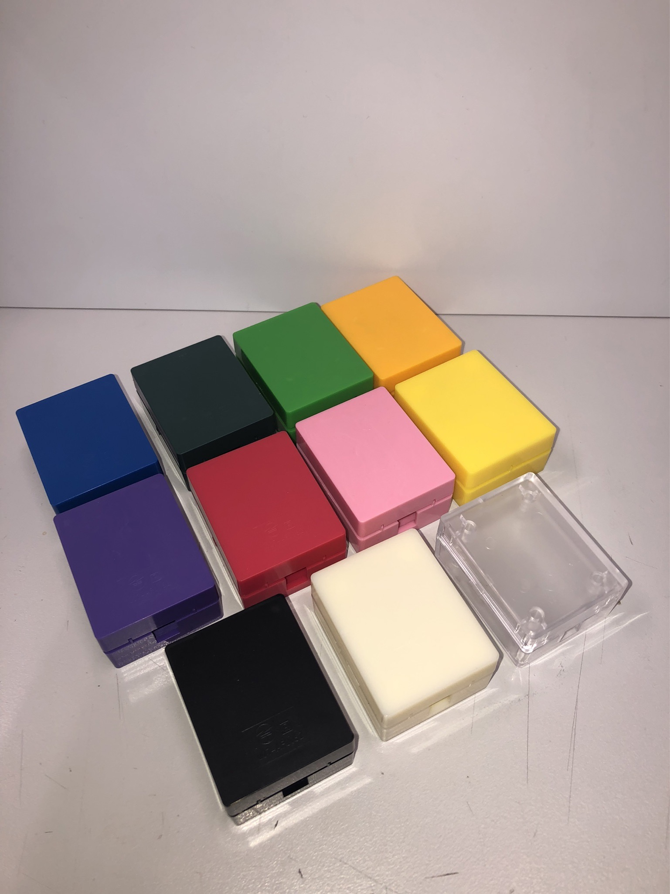
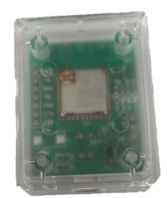
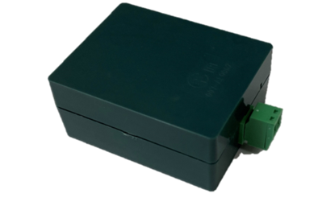

# コンパクトIoTケース

## 概要

泰興物産株式会社が開発したコンパクトなIoTケースは、IoTデバイスの保護と機能性を兼ね備えた革新的な製品です。手のひらサイズでありながら、IOポートの設計に関する課題を解決し、経済的な価格で提供します。

## 特徴

- **サイズ**: 約 37 x 47 x 20.5mmのコンパクトサイズ
- **IOポート対応**: JSTの2ピンXAコネクタなどを搭載可能
- **コスト削減**: 高額な加工コストを必要としない
- **デザイン**: 効率的な設計でIoTデバイスを保護
- **価格**: 経済的な価格設定

## 用途

このケースは、さまざまなIoTプロジェクトに適しており、特に電池駆動のIoTデバイスに最適です。裏面には磁石を貼るための窪みもあり、取り付けが簡単です。

## 使用例

### C3lessセンサー

### 2.54mm ターミナルブロック

## 対応基板データ

対応する基板データはGitHubで公開しています。設計から製造まで、皆様のIoT製品の開発を全面的にサポートします。

- [基板データはこちら](kicad/OnlyConn/)
- [Tweliteの基板アンテナを収めることもできます](kicad/twelite-PCB-Ant/)

## コネクタ3Dモデル

対応コネクタの3Dモデルは以下からダウンロード可能です。

- [S02B-XASS-1N-BN](https://www.jst-mfg.com/product/index.php?series=272)
  - 85番からダウンロード可能です。
- [WJ15EDGRC-2.54-02P-140-00A](https://componentsearchengine.com/part-view/WJ15EDGRC-2.54-02P-140-00A/WANJIE)

## 購入方法

50個以下の場合は代理店より購入ください。
50個を超える大量購入の場合は弊社までお問い合わせください

## オーダーメイド彫刻

ケース表面に、オーダーメイド彫刻をつけることができます。例えば、技適マークの表示にぴったりです。
詳しくは、お問い合わせください。

## 仕様

| 特徴   | 仕様内容   | 品番|
|:-:|:-:|:-:|
| 寸法          | 36.82 x 47.02 x 20.5 mm                        |
| 標準対応コネクタ1 | 2ピンJST XAコネクタ フックなし|02B-XASS-1N-BN|
| 標準対応コネクタ2 | 2.54mm ピッチ2ピンユーロブロック | WJ15EDGRC-2.54-02P-140-00A
|対応基板板厚 | 0.6mm~1.6mm
|材質| PC又はABS
|対応磁石寸法| 30 x 40 mm (加工公差3%)

## 注意事項

XAコネクタの品番には、02B-XASS-1N-BNと02B-XASS-1がありますが、<u>**N-BNがついていないものはボス付きの品番です。**</u>必ず、ボスなしの02B-XASS-1N-BNを使用してください。

## FAQ

- Q: どのような使い方を想定していますか？
  - 主に無線センサで、本ケース内に無線モジュールとアンテナが収まる製品を想定しています。
- ケースに収めても電波に影響は無いですか？
  - プラスチックケースですので影響は軽微だと考えられます。ただし、設置箇所の環境によっては期待した性能が発揮されないおそれがあります。
- どのような磁石に対応していますか？
  - 原則として両面テープまたは接着剤付きのラバー磁石を想定しています。
- 接着剤で磁石を貼っても良いですか？
  - 短期的には問題ありませんが、長期間運用する場合「ソルベントクラック」という現象が発生し、筐体にヒビが入ってしまうおそれがあります。そのため、推奨いたしません。
- 筐体表面に四角形の跡がありますがこれは何ですか？ 
  - ここに技適マークやFCC IDなどを表示することができます。
  - 表示方法については弊社までお問い合わせください。
- 筐体の寸法が中途半端なのはなぜですか？
  - 基板に合わせて筐体を設計したためです。また、プラスチック製品は必ず「抜き勾配」と呼ばれるテーパーがつくため、このような寸法になります。
- ケース図面はどこにありますか
  - [こちらです](drawing/)
- ケースの3Dデータはどこにありますか
  - [こちらです](3dmodel/)

## お問い合わせ

<iframe width="640px" height="480px" src="https://forms.office.com/r/fajUJ7vd6n?embed=true" frameborder="0" marginwidth="0" marginheight="0" style="border: none; max-width:100%; max-height:100vh" allowfullscreen webkitallowfullscreen mozallowfullscreen msallowfullscreen> </iframe>

---

泰興物産株式会社